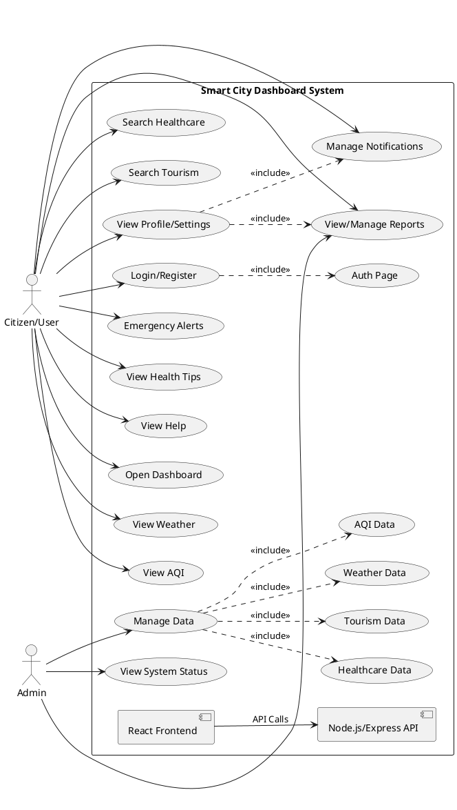
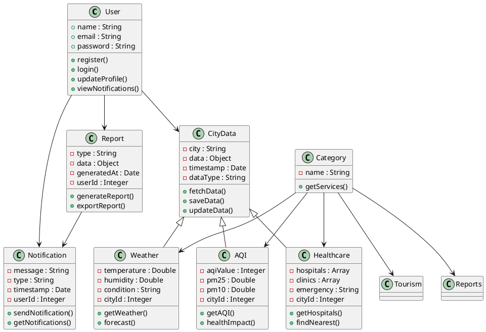
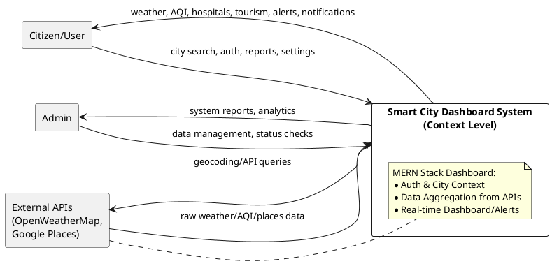
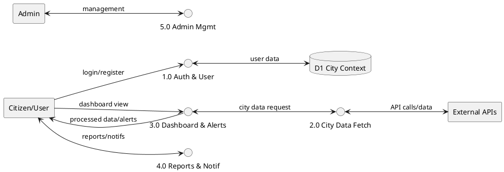
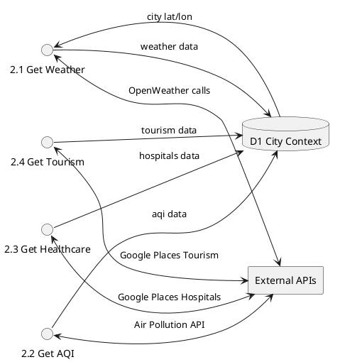

# Smart City Dashboard Project Report

## 6. DESIGN

### 6.1. System design

It is the procedure of describing the construction, components, modules, interfaces, and data for a system to satisfy specified requirements. One could understand it as the application of systems theory to product development. There is nearly a joint with the disciplines of systems analysis, systems architecture and systems engineering.

The use case diagram for our Smart City Dashboard system:



This diagram illustrates the main actors (Citizen/User and Admin), key use cases based on the project's frontend pages and backend routes, and high-level components (Frontend and Backend).

### 6.2. Class diagram

The class diagram represents the static structure of the Smart City Dashboard system, showing key entities, their attributes, methods, and relationships based on backend routes and frontend components.



This class diagram captures core domain classes derived from project features: User for authentication, CityData as base for services like Weather/AQI/Healthcare (matching backend routes), Report/Notification (matching pages/routes), with inheritance, associations, and categories.

### 6.3. Level 0 Data Flow Diagram (Context Diagram)

Level 0 DFD for Smart City Dashboard showing the system as a single process interacting with external entities.



### 6.6. User Activity Flowchart

Flowchart showing typical Citizen/User activities in the Smart City Dashboard.

```plantuml
@startuml user_flow
start
:User opens app;
if (Has token?) then (yes)
  :Go to Dashboard;
else (no)
  :Login/Register;
  if (Auth success?) then (yes)
    :Redirect to Dashboard;
  else (no)
    stop
  endif
endif

:Select service
(e.g. Weather, AQI, Healthcare);
:Enter city name;
note right
  Uses CityContext for global city
end note
:Fetch data from APIs
(OpenWeather/Google);
if (Data loaded?) then (yes)
  :Display results +
  dynamic alerts/tips;
else (no)
  :Show error +
  retry option;
endif

:Optional: Generate Report /
View Notifications;
:Update Profile/Settings;
stop
@enduml
```


### 6.4. Level 1 Data Flow Diagram



### 6.5. Level 2 Data Flow Diagram (2.0 City Data Fetch Decomposition)




